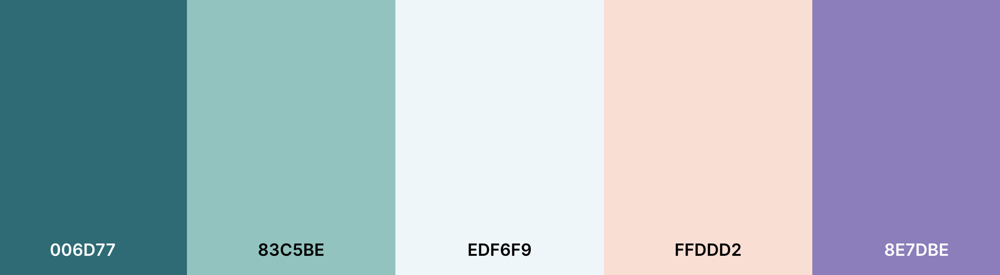

# Mindscape

Mindscape has been developed as part of Code Institute's Hackathon, partnered with Trust in Soda. This Hackathon is on "Accerlerating the future of workforce well-being and mindfulness".The brief for this Hackathon is to develop a site that rethinks soloutions to help build an initiative to improve different aspects of mental health and well-being in 2022. 

Deployed website can be viewed [here]().

## Project Goals

- To provide information to support those working from home to manage stress and feelings of lonliness and isolation.
- To provide real world tools and strategies to aid people to manage stress at work and impact of working from home.
- To encourage and support the conversation surrounding mental health in the workplace and open up dialogue. 

## UX Design

### Site Owner Goals

### User Stories
- As a user, I want to understand the purpose of the site easily.
- As a user, I want to navigate throughout the site easily and efficiently.
- As a user, I want to experience responsive design, so I can use the site on different devices.
- As a user, I want to engage with an interactive chatbox, so I can help me find ways to reduce stress whilst working.
- As a user, I want to find easy to understand content about mindfulness and stress management tools.
- As a user, I want to use different timers to encourage me to take a break from work.
- As a user, I want to listen to calming sounds.
- As a user, I want to be able to control whether I listen to the sounds or not.
- As a user, I want to write down how I am feeling and be able to clear it when finished. 
- As a user, I want to enjoy simple and streamlined design that emulates the purpose of the site.
- As a user, I want to enjoy images that reflect the aim of the site and convey feelings of calmness and relaxation. 
- As a user, I want to find social media links, so I can stay up-to-date on relevant tips and information about managing stress at work. 

### **Existing Features**
* Responsive design- the site has been developed using Bootstrap and custom CSS to ensure the site is responsive across all devices.
* Interactive chat box
* Timers- the site includes timers that enables the user to select a timer for a time out session. This encourages the user to take some time out from there day and can hold the user accountable. It's easy to say that you will take 5 minutes but when it is timed it is more likely to happen.
* Writing feature- the site includes an option for users to write down how they are feeling. This content is not saved and is cleared as soon as the user hits clear or the page is refreshed. Writing thoughts and feelings down is a really good way of letting go of stresses and frustrations. For the user, knowing it is not saved  can help people truly let go.
* Checklist- The Daily Lift Page includes a checklist where users can check off a number of items that can contribute to a happy and productive day at work. 
* Modal pop ups- On the checklist, when a user checks an item off a modal pops up with a positive message and affirmation. This is to continue to contribute to the positive work the user is attaining by using the site. 
* Social media links- In the footer there are links to various social media links, to allow users to continue to follow Mindscape.
* About page- Gives users a good understanding of why the site exists and what its mission is.

### **Features Left to Implement**
* Registration/Login - In the future users can register for an account and login. Users can then save information from the checklist and see there improvements over time, if they wish. 

### Wireframes
The wireframes for this project were developed using [Balsamiq](https://balsamiq.com/).

| Mobile | Tablet| Desktop|
--------------------|--------------------|--------------------------|
| [Mobile Home Page]() | [Tablet Home Page]() | [Desktop Home Page]() |
| [Mobile About Page]() | [Tablet About Page]() | [About Page]() |
| [Mobile Clear Your Head Page]() | [Tablet Clear Your Head Page]() | [Desktop Clear Your Head Page]() |
| [Mobile My Daily Lift Page]() | [Tablet My Daily Lift Page]() | [Desktop My Daily Lift Page]() |
| [Mobile Login Page]() | [Tablet Login Page]() | [Desktop Login Page]() |

### Changes to Wireframes

### Colour Scheme

The colours for the site were chosen using [Coolors](https://coolors.co/). The team decided that colours that reflected a sense of calmness and serenity was important, as not to further stress out the user. From this the team decided on the below palette. It is a combination of different shades of greens with a peach and purple. 

### Images

The hero image on the home page is a beach scene. This was chosen to give an immediate sense of relief and relaxtion. 

### Typography

The fonts used in the site have been chosen to ensure the user can understand and enjoy the content with ease, whilst still being appealing. The main body font is called 'Dosis', which is clear and easy to read. The team wanted a font that did not complicate the experience for the user. The navbar font is called 'Indie Flower' and is a cursive font. This is flowing and adds to the calming feeling of the site. Originally it was going to be used throughout the site, but the team decided against this at a lot this font made it hard to read. [Google Fonts](https://fonts.google.com/) was used to select the fonts.

## Technologies

### Languages
- HTML
- CSS3
- JavaScript
- Python

### Frameworks and Libraries

- [Am I Responsive?](http://ami.responsivedesign.is/) was used to create the mock ups.
- [Balsamiq](https://balsamiq.com/) was used to create the wireframes.
- [Bootstrap 5.1.3](https://getbootstrap.com/) was used to contribute to responsiveness and styling of the site.
- [Font Awesome](https://fontawesome.com/) was used for the icons.
- Git was used for version control ad to push code to GitHub.
- [GitHub](https://github.com/) was used to store the repository.
- [GitPod](https://www.gitpod.io/) was used as the IDE to develop the project.
- [Google Fonts](https://fonts.google.com/) were used to select fonts for the site.

## Testing

## Deployment

The following steps were followed to deploy the project to a live website in GitHub, using Github Pages:

- Ensure changes have been added and commited in Gitpod and pushed to GitHub.
- Login to GitHub.
- Locate the relevant repository on GitHub. This is the repository for...
- At the top of the repository, locate the 'Settings' link and click on this.
- On the left of the page, under Options, scroll down until you get to Pages and click on Pages.
- Under Source, in the first box called "None", click the dropdown and select "master".
- Then select Save.
- The page will refresh and you will see a link above the Save button. This is the link to the live site. Note that it may take a few minutes for the site to be deployed.
- There are no differences between the deployed version and the development version of this project.

### Forking the GitHub Repository
The repository can be forked on GitHub, this creates a copy of the repository that can be viewed or amended without affecting the original repository. This can be done using the following steps:

- Login to GitHub and locate the repository as before.
- At the top right of the repository (under your avatar) locate the Fork button and click this button.
- There should now be a copy of the repository in your own GitHub account, which you can amend.

### Cloning the GitHub Repository
A clone of the repository can be made, which will create a local copy on your own computer. Changes can be made to this local copy and it will not affect the original repository. Follow these steps to clone the Sunrise Yoga repository.

- Login to GitHub and locate the repository as before.
- Click the button called "Code".
- Under HTTPS copy the link provided, in this case ().
- Go to Gitpod or whichever IDE you are using and open the Terminal.
- Change the current working directory to the location where you want the cloned directory to be made.
- Type 'git clone' followed by the url you copied in step 3.
- Press "Enter" to create the local clone.
- You can refer to the GitHub documentation for more detailed information on the above process [here](https://docs.github.com/en/github/creating-cloning-and-archiving-repositories/cloning-a-repository).

## Credits

### Content

#### Website Content
- Quotes and affirmations in My Daily Lift used from [Oprah Daily](https://www.oprahdaily.com/life/relationships-love/g25629970/positive-affirmations/)
- Content regarding ways to manage stress modifed from several websites
    * https://www.today.com/health/how-deal-stress-daily-basis-t126882
    * https://www.100percentpure.com/blogs/feed/6-ways-to-instantly-de-stress
    * https://www.nhs.uk/mental-health/self-help/guides-tools-and-activities/tips-to-reduce-stress/
    
#### Fonts
- Fonts used are from [Google Fonts](https://fonts.google.com/)
- Icons used are from [Font Awesome](https://fontawesome.com/)

#### Code Content
- Card panels and modal templates in My Daily Lift used from Bootstrap

### Media

#### Images
* Hero image used from [Pexels](https://www.pexels.com/photo/person-standing-on-dock-with-water-396947/)
* Logo and banner designed using: [Canva](https://www.canva.com/)

#### Audio
* [Freesound](https://freesound.org/):
    * 'complete-task.mp3' by 'valeulloam97'
    * 'whoosh.flac' by 'qubodup'
    * 'sea.flac' by 'SamsterBirdies'

## Acknowledegments

